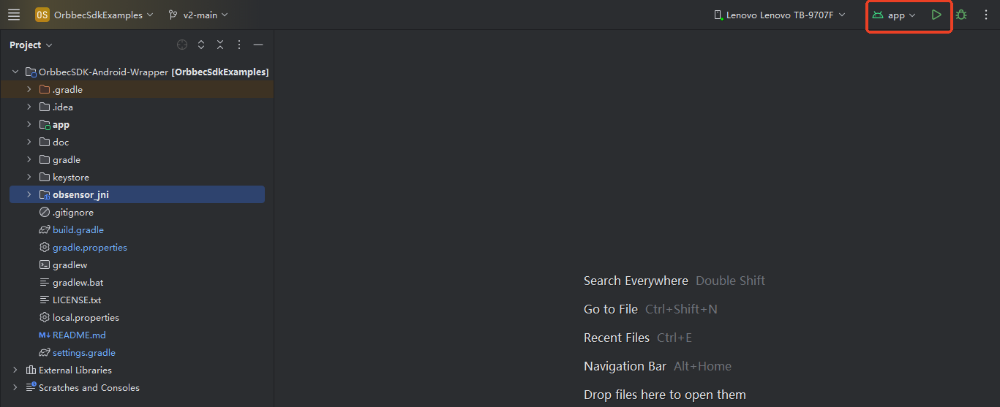
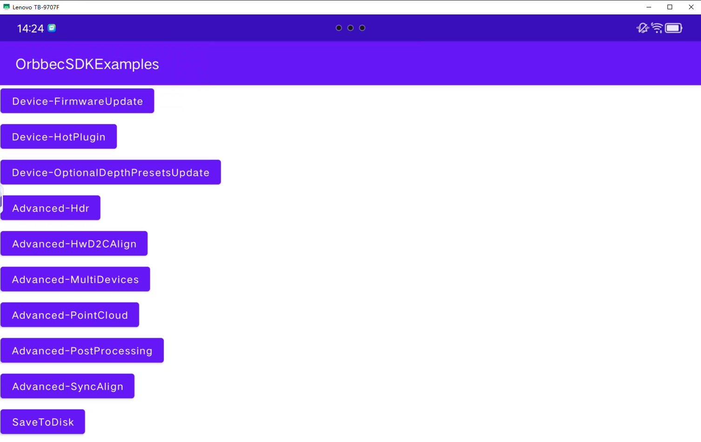
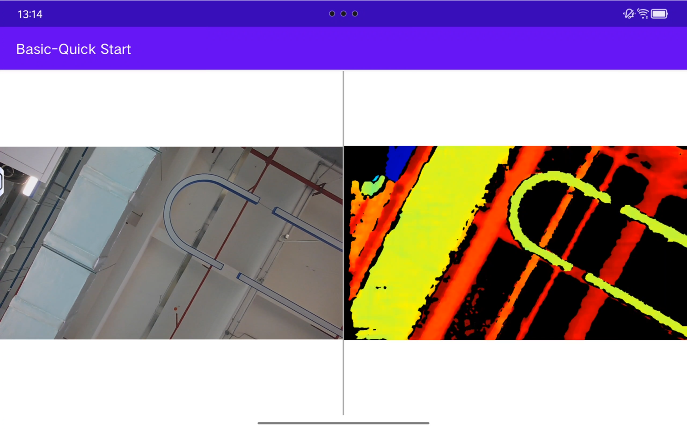
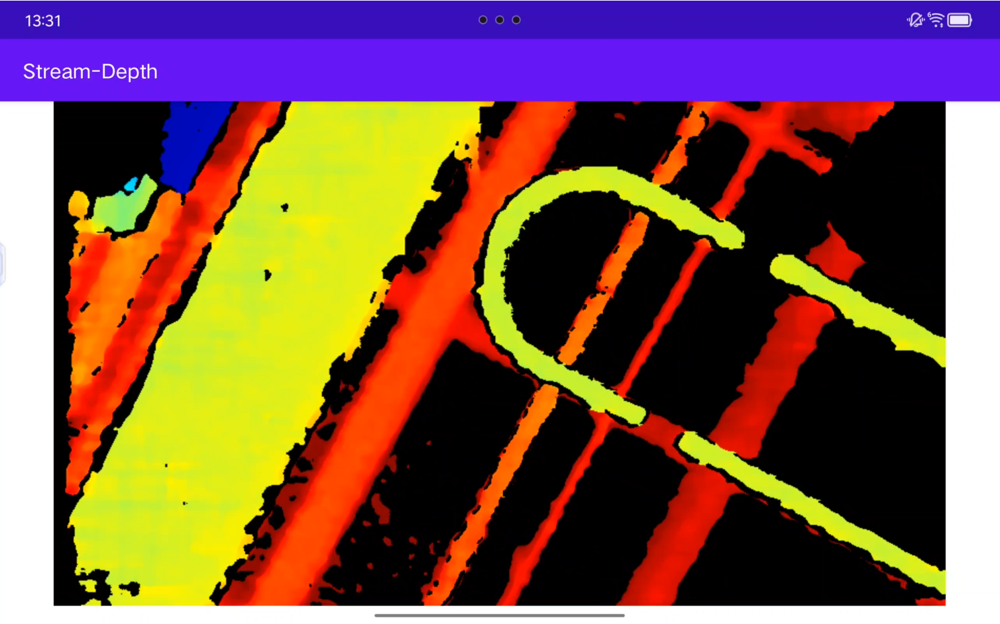
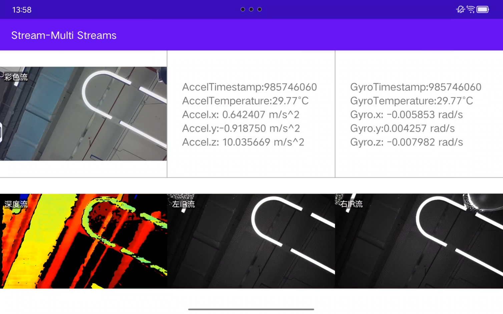

# Introduction
The v2-main branch provides an Android wrapper based on the [Orbbec SDK v2.x](https://github.com/orbbec/OrbbecSDK_v2). Orbbec SDK v2.x is an open-source, cross-platform SDK for interfacing with Orbbec RGB-D cameras. For a comparison between SDK v2.x and  [Orbbec SDK v1.x](https://github.com/orbbec/OrbbecSDK), see the [README](https://github.com/orbbec/OrbbecSDK_v2).

> [!IMPORTANT]
>
> Welcome to the Android wrapper . Before you begin using this version of Android wrapper , it's crucial to check the following device support list to verify the compatibility.

Here is the device support list of main branch (v1.x) and v2-main branch (v2.x):

<table border="1" style="border-collapse: collapse; text-align: left; width: 100%;">
  <thead>
    <tr style="background-color: #1f4e78; color: white; text-align: center;">
      <th>Product Series</th>
      <th>Product</th>
      <th><a href="https://github.com/orbbec/OrbbecSDK-Android-Wrapper/tree/main" style="color: black; text-decoration: none;">Branch main</a></th>
      <th><a href="https://github.com/orbbec/OrbbecSDK-Android-Wrapper/tree/v2-main" style="color: black; text-decoration: none;">Branch v2-main</a></th>
    </tr>
  </thead>
  <tbody>
    <tr>
      <td rowspan="6" style="text-align: center; font-weight: bold;">Gemini 330</td>
      <td>Gemini 335</td>
      <td>full maintenance</td>
      <td>recommended for new designs</td>
    </tr>
    <tr>
      <td>Gemini 336</td>
      <td>full maintenance</td>
      <td>recommended for new designs</td>
    </tr>
    <tr>
      <td>Gemini 330</td>
      <td>full maintenance</td>
      <td>recommended for new designs</td>
    </tr>
    <tr>
      <td>Gemini 335L</td>
      <td>full maintenance</td>
      <td>recommended for new designs</td>
    </tr>
    <tr>
      <td>Gemini 336L</td>
      <td>full maintenance</td>
      <td>recommended for new designs</td>
    </tr>
    <tr>
      <td>Gemini 330L</td>
      <td>full maintenance</td>
      <td>recommended for new designs</td>
    </tr>
    <tr>
      <td rowspan="5" style="text-align: center; font-weight: bold;">Gemini 2</td>
      <td>Gemini 2</td>
      <td>full maintenance</td>
      <td>recommended for new designs</td>
    </tr>
    <tr>
      <td>Gemini 2 L</td>
      <td>full maintenance</td>
      <td>recommended for new designs</td>
    </tr>
    <tr>
      <td>Gemini 210</td>
      <td>not supported</td>
      <td>recommended for new designs</td>
    </tr>
    <tr>
      <td>Gemini 215</td>
      <td>not supported</td>
      <td>recommended for new designs</td>
    </tr>
    <tr>
      <td>Gemini 2 XL</td>
      <td>recommended for new designs</td>
      <td>to be supported</td>
    </tr>
    <tr>
      <td rowspan="3" style="text-align: center; font-weight: bold;">Astra</td>
      <td>Astra 2</td>
      <td>full maintenance</td>
      <td>recommended for new designs</td>
    </tr>
    <tr>
      <td>Astra+</td>
      <td>limited maintenance</td>
      <td>not supported</td>
    </tr>
    <tr>
      <td>Astra Pro Plus</td>
      <td>limited maintenance</td>
      <td>not supported</td>
    </tr>
    <tr>
      <td style="text-align: center; font-weight: bold;">Astra Mini</td>
      <td>Astra Mini Pro</td>
      <td>full maintenance</td>
      <td>not supported</td>
    </tr>
  </tbody>
</table>

**Note**: If you do not find your device, please contact our FAE or sales representative for help.

**Definition**:

1. recommended for new designs: we will provide full supports with new features,  bug fix and performance optimization;
2. full maintenance: we will provide bug fix support;
3. limited maintenance: we will provide critical bug fix support;
4. not supported: we will not support specific device in this version;
5. to be supported: we will add support in the near future.


## Hardware Products Supported by Android SDK

| **Products List** | **Minimal Firmware Version** |
|-------------------|------------------------------|
| Gemini 330        | 1.2.20                       |
| Gemini 330L       | 1.2.20                       |
| Gemini 335        | 1.2.20                       |
| Gemini 335L       | 1.2.20                       |
| Gemini 336        | 1.2.20                       |
| Gemini 336L       | 1.2.20                       |
| Astra 2           | 2.8.20                       |
| Gemini 2 L        | 1.4.53                       |
| Gemini 2          | 1.4.92               |
| Gemini 215        | 1.0.9                        |
| Gemini 210        | 1.0.9                        |


## import project
1. Open Android studio
2. Menu: File --> open, and select project directory
3. Click Ok button
4. wait gradle sync complete


## run example
### build example
Click run button


### Main UI


Click 'Basic-Quick Start' to display the color and depth sensor streams.

### QuickStart


### Depth


### MultiStreams


# Build Tools
## Android studio
Android studio **Koala | 2024.1.1**
download link [Android studio](https://developer.android.com/studio)

## NDK
**version:** 21.4.7075529

## CMake
**version:** 3.18.1

## gradle
gradle/wrapper/gradle-wrapper.properties
```txt
distributionUrl=https\://services.gradle.org/distributions/gradle-8.0-bin.zip
```

## gradle pulgins
build.gradle
```groovy
plugins {
id 'com.android.application' version '8.1.0' apply false
    id 'org.jetbrains.kotlin.android' version '1.8.10' apply false
    id 'com.android.library' version '8.1.0' apply false
}
```

# library and example
## sensorsdk
Orbbec basic sdk implementation with c & cpp, android wrapper import sensorsdk as so.

## so files
**path:** obsensor_jni/libs

## include headers
**path:** obsensor_jni/src/main/cpp/sensorsdk

_Note_: To short include path in native code, module of 'obsensor_jni' import as path 'obsensor_jni/src/main/cpp/sensorsdk/include/libobsensor'

## obsensor_jni
Android wrapper implementation with jni which is forward or transfer data between java and native sensorsdk. 

## Support android version
- Test on the Android 13
- Note: If using Android 10, set targetSdk to 27
```groovy
minSdk 24
//noinspection ExpiredTargetSdkVersion
targetSdk 27
```
**targetSdkVersion** 27 to fixed bug 'Android 10 Devices Do NOT Support USB Camera Connection' which fixed on android 11.
\[reference 01] [Android 10 sdk28 usb camera device class bug.](https://forums.oneplus.com/threads/android-10-sdk28-usb-camera-device-class-bug.1258389/)

\[reference 02] [Android 10 Devices Do NOT Support USB Camera Connection.](https://www.camerafi.com/notice-android-10-devices-do-not-support-usb-camera-connection/)

# Simple code of open depth stream
Create OBContext global member to manager attach devices
```java
// Application hold only one OBContext instance.
private OBContext mOBContext;
private Object mCurrentDeviceLock = new Object();
private Device mCurrentDevice;
private DeviceInfo mCurrentDeviceInfo;
```

Initialize OBContext with DeviceChangedCallback
```java
mOBContext = new OBContext(getApplicationContext(), new DeviceChangedCallback() {
   @Override
   public void onDeviceAttach(DeviceList deviceList) {
        try {
            mCurrentDevice = deviceList.getDevice(0);
            mCurrentDeviceInfo = mCurrentDevice.getInfo();
            deviceList.close();
            // do something
        } catch (Exception e) {
            e.printStackTrace();
        } finally {
            deviceList.close();
        }
   }

   @Override
   public void onDeviceDetach(DeviceList deviceList) {
         try {
            if (null != mCurrentDevice){
                int deviceCount = deviceList.getDeviceCount();
                    for(int i = 0; i < deviceCount; i++){
                        String uid = deviceList.getUid();
                        if(null != mCurrentDeviceInfo && mCurrentDeviceInfo.getUid().equals(uid)){
                            // handle device disconnection
                            // do something

                            Log.d("Orbbec","Device disconnection. name: "+mCurrentDeviceInfo.getName()+", uid: "+mCurrentDeviceInfo.getUid());
                            mCurrentDevice.close();
                            mCurrentDevice=null;
                        }
                    }
            }
         } catch (Exception e) {
            e.printStackTrace();
         } finally {
            deviceList.close();
        }
   }
});
```

Define Pipeline and Device
```java
private Pipeline mPipeline;
```

Start Depth stream
```java
try {
   mPipeline = new Pipeline(mCurrentDevice);

   StreamProfileList depthProfileList = mPipeline.getStreamProfileList(SensorType.DEPTH);
   if (null == depthProfileList) {
      return;
   }
   StreamProfile streamProfile = depthProfileList.getStreamProfile(0);
   Config config = new Config();
   config.enableStream(streamProfile);
   streamProfile.close();
   depthProfileList.close();

   mPipeline.start(config, new FrameSetCallback() {
      public void onFrameSet(FrameSet frameSet) {
         DepthFrame depthFrame = frameSet.getDepthFrame()
         if (null != depthFrame) {
            Log.d("Orbbec", "onFrameSet depthFrame index: " + depthFrame.getFrameIndex() + ", timeStamp: " + depthFrame.getTimeStamp());

            // do Render

            depthFrame.close();
         }
      }
   });
   config.close();
} catch (OBException e) {
   e.printStackTrace();
}
```

Stop stream
```java
try {
   mPipeline.stop();
} catch (OBException e) {
   e.printStackTrace();
}
```

Close device
```java
try {
   if (null != mPipeline) {
      mPipeline.close();
   }

   if (mDevice != null) {
      mDevice.close();
   }
} catch (OBException e) {
   e.printStackTrace();
}
```


# QA
## LintModelSeverity has been compiled by a more recent version of the Java 
```
An exception occurred applying plugin request [id: 'com.android.application']
> Failed to apply plugin 'com.android.internal.application'.
   > Could not create an instance of type com.android.build.gradle.internal.dsl.ApplicationExtensionImpl$AgpDecorated.
      > Could not create an instance of type com.android.build.gradle.internal.dsl.LintImpl$AgpDecorated.
         > Could not generate a decorated class for type LintImpl$AgpDecorated.
            > com/android/tools/lint/model/LintModelSeverity has been compiled by a more recent version of the Java Runtime (class file version 61.0), this version of the Java Runtime only recognizes class file versions up to 55.0

* Try:
> Run with --info or --debug option to get more log output.
> Run with --scan to get full insights.
```

**Reason**: AGP(android gradle plugin) is v8.1.0, need jdk 17, Please update android studio to new version, and check gradle jdk version.
Android studio --> File --> Settings --> Build,Execution,Deployment --> Build Tools --> Gradle, check Gradle Projects -> Gradle JDK 

**reference**: 
https://developer.android.com/studio/releases#android_gradle_plugin_and_android_studio_compatibility

https://developer.android.com/build/releases/gradle-plugin
