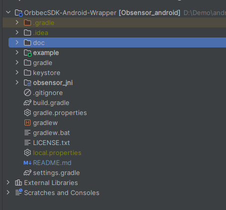
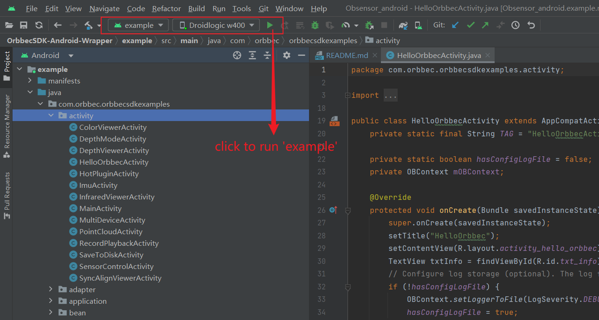
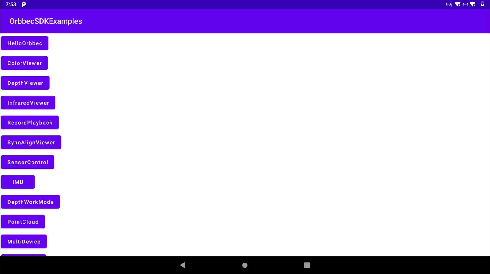
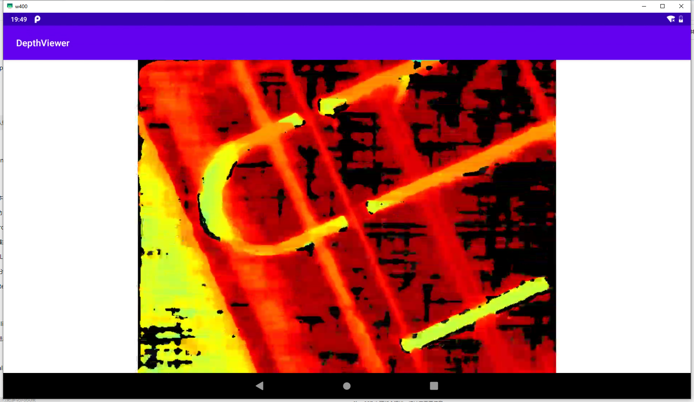

# Quick start
## download source
```
git clone https://github.com/orbbec/OrbbecSDK-Android-Wrapper.git
```

## import project
1. Open Android studio
2. Menu: File --> open, and select project directory
3. Click Ok button
4. wait gradle sync complete



## run example

### build example


### Main UI


Click 'DepthViewer' to show depth sensor stream.

### DepthViewer


# Build Tools
## Android studio
Android studio **Giraffe | 2022.3.1 Patch 1**
download link [Android studio](https://developer.android.com/studio)

## NDK
**version:** 21.4.7075529

## CMake
**version:** 3.18.1

## gradle
gradle/wrapper/gradle-wrapper.properties
```txt
distributionUrl=https\://services.gradle.org/distributions/gradle-8.0-bin.zip
```

## gradle pulgins
build.gradle
```groovy
plugins {
id 'com.android.application' version '8.1.0' apply false
    id 'org.jetbrains.kotlin.android' version '1.8.10' apply false
    id 'com.android.library' version '8.1.0' apply false
}
```

# library and example
## sensorsdk
Orbbec basic sdk implementation with c & cpp, android wrapper import sensorsdk as so.

## so files
**path:** obsensor_jni/libs

## include headers
**path:** obsensor_jni/src/main/cpp/sensorsdk

_Note_: To short include path in native code, module of 'obsensor_jni' import as path 'obsensor_jni/src/main/cpp/sensorsdk/include/libobsensor'

## obsensor_jni
Android wrapper implementation with jni which is forward or transfer data between java and native sensorsdk. 

## Support android version
```groovy
minSdk 24
//noinspection ExpiredTargetSdkVersion
targetSdk 27
```
**targetSdkVersion** 27 to fixed bug 'Android 10 Devices Do NOT Support USB Camera Connection' which fixed on android 11.
\[reference 01] [Android 10 sdk28 usb camera device class bug.](https://forums.oneplus.com/threads/android-10-sdk28-usb-camera-device-class-bug.1258389/)

\[reference 02] [Android 10 Devices Do NOT Support USB Camera Connection.](https://www.camerafi.com/notice-android-10-devices-do-not-support-usb-camera-connection/)

## example
Example of sensorsdk android wrapper

## Support android version
```groovy
minSdk 24
//noinspection ExpiredTargetSdkVersion
targetSdk 27
```
**targetSdkVersion** 27 to fixed bug 'Android 10 Devices Do NOT Support USB Camera Connection' which fixed on android 11.

# Support orbbec device
OrbbecSDK：v1.10.3
Publish: 2024-11-08
Support device list (firmware version):
| SDK version | Product | Firmware version |
| --- | --- | --- |  
| v1.10.3	  | Gemini 335       | 1.2.20                      |
| 	          | Gemini 335L      | 1.2.20                      |
|       	  | Gemini 336       | 1.2.20                      |
|       	  | Gemini 336L      | 1.2.20                      |
|       	  | Gemini 2 XL      | Obox: V1.2.5  VL:1.4.54     |
|       	  | Astra 2          | 2.8.20                      |
| 		      | Gemini 2 L       | 1.4.32                      |
| 		      | Gemini 2         | 1.4.60 /1.4.76              |
|             | Astra+           | 1.0.22/1.0.21/1.0.20/1.0.19 |
|             | Femto            | 1.6.7                       |
|             | Femto W          | 1.1.8                       |
|             | DaBai            | 2436                        |
|             | DaBai DCW        | 2460                        |
|             | DaBai DW         | 2606                        |
|             | Astra Mini Pro   | 1007                        |
|             | Gemini E         | 3460                        |
|             | Gemini E Lite    | 3606                        |
|             | Gemini           | 3.0.18                      |
|             | Astra Mini S Pro | 1.0.05                      |

# Simple code of open depth stream
Create OBContext global member to manager attach devices
```java
// Application hold only one OBContext instance.
private OBContext mOBContext;
private Object mCurrentDeviceLock = new Object();
private Device mCurrentDevice;
private DeviceInfo mCurrentDeviceInfo;
```

Initialize OBContext with DeviceChangedCallback
```java
mOBContext = new OBContext(getApplicationContext(), new DeviceChangedCallback() {
   @Override
   public void onDeviceAttach(DeviceList deviceList) {
        try {
            mDevice = deviceList.getDevice(0);
            deviceList.close();
            // do something
            mDevice.close();
        } catch (Exception e) {
            e.printStackTrace();
        }
   }

   @Override
   public void onDeviceDetach(DeviceList deviceList) {
         try {
            if (null != mCurrentDevice){
                int deviceCount=deviceList.getDeviceCount();
                    for(int i=0;i<deviceCount; i++){
                        String uid=deviceList.getUid();
                        if(null!=mCurrentDeviceInfo&&mCurrentDeviceInfo.getUid().equals(uid)){
                            // handle device disconnection
                            // do something

                            Log.d("Orbbec","Device disconnection. name: "+mCurrentDeviceInfo.getName()+", uid: "+mCurrentDeviceInfo.getUid());
                            mCurrentDevice.close();
                            mCurrentDevice=null;
                        }
                    }
            }
         } catch (Exception e) {
            e.printStackTrace();
         } finally {
            deviceList.close();
        }
   }
});
```

Define Pipeline and Device
```java
private Pipeline mPipeline;
```

Start Depth stream
```java
try {
   mPipeline = new Pipeline(mCurrentDevice);

   StreamProfileList depthProfileList = mPipeline.getStreamProfileList(SensorType.DEPTH);
   if (null != depthProfileList) {
      depthProfileList.close();
      return;
   }
   StreamProfile streamProfile = depthProfileList.getStreamProfile(0);
   Config config = new Config();
   config.enableStream(streamProfile);
   streamProfile.close();
   depthProfileList.close();

   mPipeline.start(config, new FrameSetCallback() {
      public void onFrameSet(FrameSet frameSet) {
         DepthFrame depthFrame = frameSet.getDepthFrame()
         if (null != depthFrame) {
            Log.d("Orbbec", "onFrameSet depthFrame index: " + depthFrame.getFrameIndex() + ", timeStamp: " + depthFrame.getTimeStamp());

            // do Render

            depthFrame.close();
         }
      }
   });
   config.close();
} catch (OBException e) {
   e.printStackTrace();
}
```

Stop stream
```java
try {
   mPipeline.stop();
   mPipeline.close();
   mPipeline = null;
} catch (OBException e) {
   e.printStackTrace();
}
```


# QA
## LintModelSeverity has been compiled by a more recent version of the Java 
```
An exception occurred applying plugin request [id: 'com.android.application']
> Failed to apply plugin 'com.android.internal.application'.
   > Could not create an instance of type com.android.build.gradle.internal.dsl.ApplicationExtensionImpl$AgpDecorated.
      > Could not create an instance of type com.android.build.gradle.internal.dsl.LintImpl$AgpDecorated.
         > Could not generate a decorated class for type LintImpl$AgpDecorated.
            > com/android/tools/lint/model/LintModelSeverity has been compiled by a more recent version of the Java Runtime (class file version 61.0), this version of the Java Runtime only recognizes class file versions up to 55.0

* Try:
> Run with --info or --debug option to get more log output.
> Run with --scan to get full insights.
```

**Reason**: AGP(android gradle plugin) is v8.1.0, need jdk 17, Please update android studio to new version, and check gradle jdk version.
Android studio --> File --> Settings --> Build,Execution,Deployment --> Build Tools --> Gradle, check Gradle Projects -> Gradle JDK 

**reference**: 
https://developer.android.com/studio/releases#android_gradle_plugin_and_android_studio_compatibility

https://developer.android.com/build/releases/gradle-plugin
